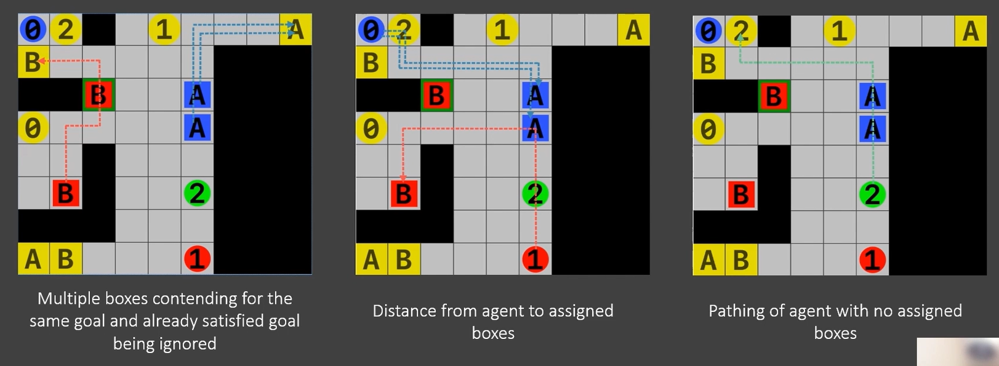

# MoveIt

Project is about agents moving in a grid world. Each agent has a specific color assigned and can move itself, and push or pull boxes of the same color. The goal is to move all boxes and agents to the goal positions, marked by the letters of the boxes or the numbers of the agent. The goal is to find the solution as fast as possible a solution for the problem. Algorithm was implemented in collaboration with the team from DTU course.

# Preprocessing

In order to save computational power and time, preprocessing is done. The preprocessing is done in the following steps. First, we convert all of the boxes that cannot be moved to walls. An example can be the box that its color does not correspond to any of the agents.

After that we calculate all the distances between connected cells and the shortest path between them. The distances consider only walls, at this point it ignores other agents and boxes, and treats them as it does not exist. To save a space only the next cell on the path is stored instead of the whole path. Thanks to that we can store all the metadata in **O(s*s)** space, where **s** is the number of cells on the map and we can retrieve the path in **O(s)** time. 

# Algorithm

## Find goals

First, we find the closest available goal spot, that is not already satisfied, for each box. Many boxes can have chosen the same goal spot. Then the distances from agent to each corresponding box are retrieved.

## Find subplans

At this point we create the subplans for each agent. Each agent choose the the plan that requires the lowest amount of actions to satisfy a single goal. However, agent will prioritize to satisfy the goal of his corresponding boxes and after that his own goal. To find the subplan, precomputed paths are translated into required actions.

At this point we choose the agent that requires the lowest amount of actions to satisfy a single goal. However, agent will prioritize to satisfy the goal of his corresponding boxes and after that his own goal. 

## Agents prioritization

Algorithm chooses one prioritized agent that his subplan is going to be executed. First of all agents that include box goals in their subplans are prioritized. Later we look at the agents with the least number of obstacles on their planed paths. If there is a case where two agents have the same number of obstacles, the agent with the shortest subplan to the goal is chosen. If there is a case where two agents have the same number of obstacles and the same path length, the agent with the lowest id is chosen.

## Conflict recognition

Now prioritized agents plan is executed until the conflict (pre-conflict state) is encountered. When it happens the algorithm finds the desired state after conflict (post-conflict).

## Conflict resolution

To resolve the conflict the weighted **AStar** algorithm is run with the following heuristics:

- Distance between the current and desired agent position in the post conflict state
- Number of unsatisfied goals
- Number of obstacles on the conflict area

## Repeat

The above algorithm is repeated until all of the goals are satisfied.